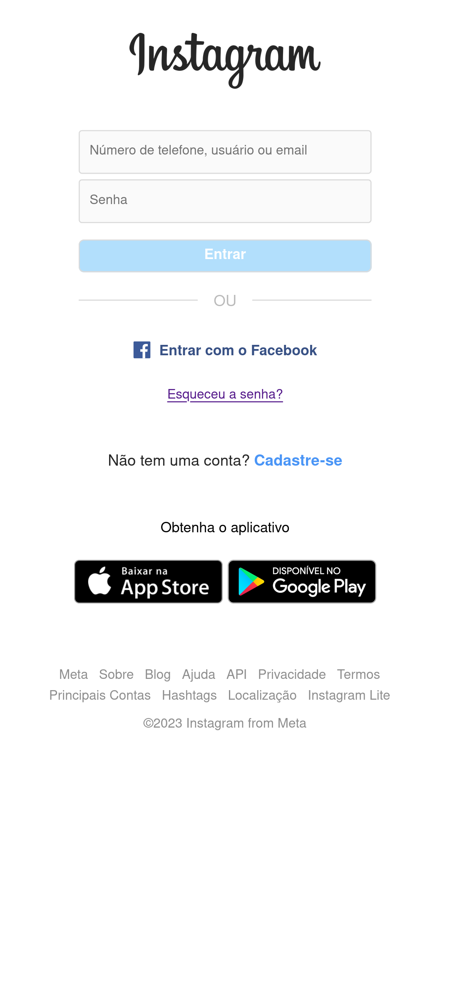
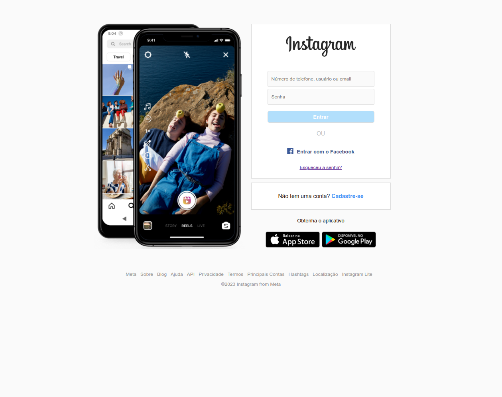

# Clone da Interface de Login do Instagram

Este projeto é uma cópia da interface de login do Instagram. Ele reproduz fielmente a aparência da página de login do Instagram, utilizando HTML e CSS.

## Como Usar

- Abra o arquivo `index.html` em um navegador da web para visualizar a página de login do Instagram clonada.
- Você pode fazer modificações editando o arquivo `css/style.css` para atualizar os estilos ou o arquivo `index.html` para alterar o conteúdo.
- Este projeto é uma cópia da interface de login do Instagram e pode ser usado como referência para práticas de front-end.

## Tecnologias Utilizadas

- HTML
- CSS

## Estrutura do Projeto

A estrutura do projeto inclui os seguintes arquivos e pastas:

- `index.html`: A página HTML que contém a cópia da interface de login do Instagram.
- `css/style.css`: O arquivo CSS que define os estilos da página.
- `imagens/`: Uma pasta contendo as imagens usadas na página de login.

## Contribuições

Este projeto é uma simples cópia da interface de login do Instagram e não aceita contribuições. Ele é fornecido apenas para fins de aprendizado e referência.

## Licença

Este projeto é apenas uma cópia da interface de login do Instagram e não tem uma licença específica. O Instagram é uma marca registrada da Meta Platforms, Inc.

---

Este projeto foi criado apenas para fins de aprendizado e demonstração. Respeite os direitos autorais e marcas registradas do Instagram.

## Foto final na versão mobile

## Foto final na versão Desktop

